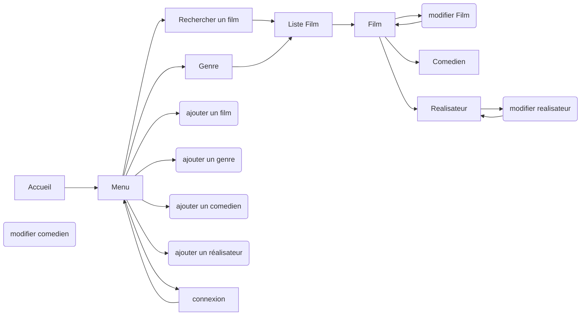
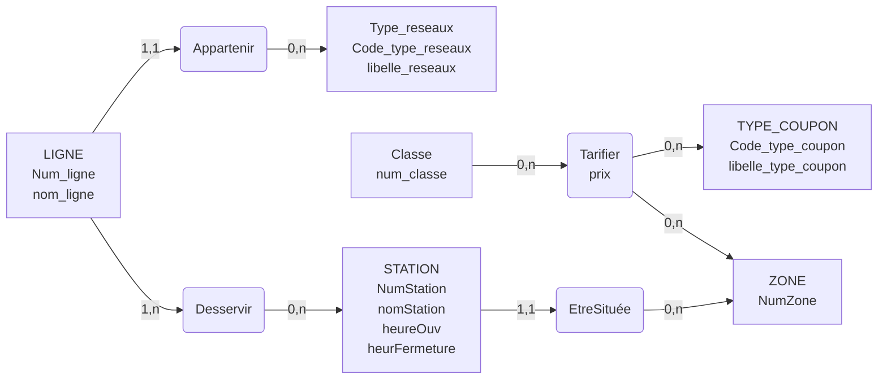
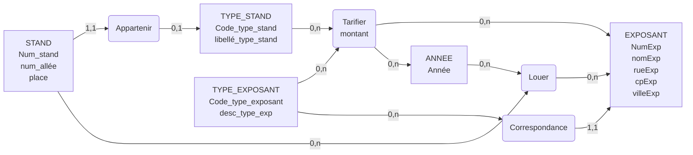

# BUT 2024-2025 (R1)

## Intro C (R1.01)

### TD [12/09/2024]

```c
// ex2
void affiche_nombres(int n){
	for(int i=1; i<=n ;i++){
		printf("%d",i);
	}
}

void affiche_nombres_pairs(int n){
	for(int i=2; i<=n ;i+=2){
		printf("%d",i);
	}
}

void affiche_nombres_decroissants(int n){
	for(int i=n; i>0 ;i--){
		printf("%d",i);
	}
}

//ex3

int somme_impairs(int n){
	int somme=0;
	for(int i=1; i<n ;i+=2){
		somme+=i;
	}
	return somme;
}

int factoriel(int n){
	return n!;

}

```
### TD [12/09/2024]
```c
#include <stdlib.h>

int lance_un_de(){
	return (rand()%6)+1;
}

void lance_1000(){
	int n1,n2,n3,n4,n5,n6;
	n1=n2=n3=n4=n5=n6;
	
	for (int i=0; i < 1000 ;i++){
		int tmp=lance_un_de();
		if (tmp == 1) n1++;
		if (tmp == 2) n2++;
		if (tmp == 3) n3++;
		if (tmp == 4) n4++;
		if (tmp == 5) n5++;
		if (tmp == 6) n6++;
	}
	
	printf("1000 tirages : \n1 : %d \n2 : %d \n3 : %d \n4 : %d \n5 : %d \n6 : %d",n1,n2,n3,n4,n5,n6);
}

void lance_x_fois(){
	int n1,n2,n3,n4,n5,n6;
	n1=n2=n3=n4=n5=n6;
	
	int fois;
	printf("entrer un nombre")
	scanf("%d",&fois);
	
	for (int i=0; i < fois ;i++){
		int tmp=lance_un_de();
		if (tmp == 1) n1++;
		if (tmp == 2) n2++;
		if (tmp == 3) n3++;
		if (tmp == 4) n4++;
		if (tmp == 5) n5++;
		if (tmp == 6) n6++;
	}
	
	printf("%d tirages : \n1 : %d \n2 : %d \n3 : %d \n4 : %d \n5 : %d \n6 : %d",fois,n1,n2,n3,n4,n5,n6);
}


int main(){
	srand(2);
	lance_1000();
	return 0;
}
```

### TD [12/09/2024]
```c
void echange_int(int *a, int *b){
	int tmp=&a
	*a=&b
	*b=tmp
}

double solve2d(double a, double b, double c, double *x1, double *x2){
	double delta = b*b - 4*a*c;
	if (delta>0){
		*x1=(-b-sqrt(delta))/2*a
		*x2=(-b+sqrt(delta))/2*a
	}
}
```
### TD [04/10/2024]
```c
int nombre_de_chiffre(int n){
	 int i=0;
	 while(n>0){
		 n=n/10;
		 i++;
	 }
}

int plus_grand_chiffre(int n){
	int max=0;
	while(n>0){
		if(n%10>max){
			max=n%10;
		}
		n=n/10;
	}
}

struct date {
	int jour;
	int mois;
	int annee;
}

struct date today = {4,10,2024};
```
### TD [12/10/24]
```c
int recherche(int* tab, int taille, int rech){
	for (int i=0; i<taille ;i++){
		if(tab[i]==rech) return 1;
	}
	return 0;
}

int sup_10(int tab[], int taille){
	int max=0;
	for(int i=0; i<taille ;i++){
		if (tab[i]>=10){
			max++;
		}
	}
	return max;
}

int croissant(int tab[], int taille]{
	for(int i=1; i<taille ;i++){
		if(tab[i-1]>tab[i]) return 0;
	}
	return 1;
}

int* inverse(int tab[], int taille){
	tab_inverse[taille];
	for(int i=taille; i>0 ;i--){
		tab_inverse[i]=tab[i];
	}
	return tab_inverse;
}

## Fibonnacci
int fibonnacci(int n){


}
```
### TD [15/10/24]
```c
#include <stdio.h>

void passage_bulle(int tab[], int n) {
    int temp;
    for (int i = 0; i < n - 1; i++){
	    if (tab[i]>tab[i+1]){
		    temp = tab[i]
		    tab[i]=tab[i+1]
		    tab[i+1]=temp
	    }        
    }
}

```

----
### TD [22/10/24]
```c

void fusion_2tableaux_tries(int tab1[], int taille1, int tab2[], int taille2, int tab3[], int taille){
	int n=1;
	tab3[0]=0;
	for(int i=0; i<taille1 ;i++){
		for(int j=0; j<taille2 ;j++){
		    
		    printf("%d %d %d\n",tab1[i],tab2[j],tab3[n-1]);
			if(tab1[i]>tab2[j] && tab3[n-1]<tab2[j]){
				tab3[n]=tab2[j];
				n++;
			}
			else if(tab3[n-1]<tab1[i]){
				tab3[n]=tab1[i];
				n++;
				//break;
			}
		}
	}
}

```
**on cherche 6**
| 0 |1 | 2| 3 | 4 | 5| 6 | 7 | 8 | 9 
|--|--|--|--|--|--|--|--|--|--|
| 3 | 4 | 6 | 8 | ==10== | 11 | 12 | 15 | 17 | 19

->
| 0 |1 | 2 | 3 | 4  
|--|--|--|--|--|--|--|--|--|--|
| 3 | ==4== | 6 | 8 | 10 

->
| 1 | 2 | 3 | 4  
|--|--|--|--|--|--|--|--|--|--|
| 1 | ==6== | 8 | 10 

-----
### TD [05/11/24]
```c
void invertstring(char chaine[]){
	int taille=0;
	while(chaine[taille]=!'\0') taille++;
	
	for (int i=0; i<taille/2 ;i++){
		int temp =chaine[i];
		chaine[i]=chaine[taille-i-1];
		chaine[taille-i-1]=temp;
	}
}

int substring(char src[], char dest[], int d, int f){
	int n=0;
	for ( int i=d; i<f ;i++){
		dest[n]=src[i];
		n++;
	}
	dest[n]='\0';
	return n;	
}

int verifie_expression_1(char chaine[]){
	int n=0;
	int comp=;
	while( chaine[n]=!'\0'){
		if(chaine[n]=='(') comp++;
		if(chaine[n]==')') comp--;
		n++;
	}
	return comp==0;
}
```

## Web (R1.02)

### TD [03/10/24]




## Architecture PC (R1.03)

### CM 2 [10/09/24]

##### base 2
 **additions**
- logique de retenue : 1 -> 10 -> 11 -> 100 -> ...
- 
##### base 16
**additions**
- transformation en décimal : F + B *(10)=>* 15 +11 = 26 *(16)=>* 1A 
- 
**multiplications**
- table de multiplications fourni
- 

## Intro système d'exploitation (R1.04)
 


## Merise (R1.05)


### TD 1 [05/09/24]

[tableau merise](./merise/merise.ods)

### TD1 [05/09/24]

N|  |Etudiant  |ordinateur|achat|club-sport
   |--|--|--|--|--|--|
0|  | 1 |4|7|10|
1 |**num-etudiant**|*||||
2|nom-etudiant|1||||
3|num-etudiant|1||||
4|num-serie||*|||
5|taille||1|||
6|memoire||1|||
7|num-etudiant|||*||
8|date_achat|||1||
9|magasin|||1||
10|num_club|(1)|||*|
11|taille||||1|
12|num-etudiant||||1|
---

N|Données|Reservation|Client|appartement|
|--|--|:--:|:--:|:--:|
0 | | 1 | 8 | 7 | 10 |
1 |numero_reservation|*|||
2 |date_reservation|1|||
3 |reference_client|(1)|*||
4 |nom_client||1||
5 |prenom_client||1||
6 |rue_client||1||
7 |cp_client||1||
8 |ville_client||1||
9 |||1||
10 |||1||
11 |num-etudiant|||1|
12 |ville_appartement|||1|
13 |tarif|||1|
14 |num-etudiant||||
15 |nb_semaine|1|||
16 |nb_personne|1|||

---

N|Données|Voyage|Salarie|Categorie|insciption|
|--|--|:--:|:--:|:--:|:--:|
0 | | 1 | 9 | 10 | 16 |
1 |==num_voyage==|*|||
2 |type_voyage|1|||
3 |destination_voyage|1|||
4|date_depart_voyage|1||
5 |duree_voyage|1|||
6 |prix_base_adulte|1|||
7 |prix_base_enfant|1|||
8 |date_inscription_voyage||||1
9 |==matricule_salarie==||*||
10 |==csp_salarie==||(1)|*|
11 |coef_multiplicateur|||1|
12 |nom_salarie||1||
13 |prenom_salarie||1||
14 |nb_adultes_inscrit||||1|
15 |nb_enfants_inscrits||||1|
16 |==1+9==||||*|

---

N|Données|Ligne|Reseaux|Station|Zone|Coupon|Classe|acheter
|--|--|:--:|:--:|:--:|:--:|:--:|:--:|:--:|
0 | | 1 | 6 | 3 | 8 | 11 | 13 | 14 |
1 |==num_ligne==|*|||
2 |nom_ligne|1|||
3 |==code_type_reseaux==|(1)|*||
4 |longueur_ligne|1||
5 |libelle_reseaux||1||
6 |==num_station==|||*|
7 |nom_station|||1|
8 |==num_zone==|||(1)|*|
9 |heure_ouverture|||1|
10 |heure_fermeture|||1|
11 |code_type_coupon|||||*
12 |==libelle_type_coupon==|||||1
13 |==num_classe==||||||*
14 |==13+8+11==|||||||*
15 |prix_coupon|||||||1

### TD2  [24/09/24]


---
N|Nom|Format|Type|Contrainte d'integrité|
|--|--|:--:|:--:|:--:|:--:|:--:|:--:|:--:|
1 |num_stand||E||
2 |num_allée||E||
3 |place||||
4 |code_type_stand|||
5 |libellé_type_stand||||
6 |code_type_exposant||||
7 |num_exposant||||
8 |nom_exp|||
9 |rue_exp||||
10 |cp_exp||||
11 |desc_type_exp||||
12 |ville_exp||||
13 |année|||||
14 |montant|||||


---
N|Données|Stand|Type_stand|Type_exposant|Exposant|Tarifer|Année|
|--|--|:--:|:--:|:--:|:--:|:--:|:--:|:--:|
0 | | 1 | 4 | 6 | 8 | 15 | 13 |  |
1 |==num_stand==|*|||
2 |num_allée|1|||
3 |place|1|||
4 |==code_type_stand==|(1)|*|
5 |libellé_type_stand||1||
6 |==code_type_exposant==|||*|(1)
7 |==num_exposant==||||*
8 |nom_exp||||1
9 |rue_exp||||1
10 |cp_exp||||1
11 |desc_type_exp|||1|
12 |ville_exp||||1
13 |==année==||||||*
14 |montant|||||1
15 |==4+6+13==|||||*




### CM 2 [10/09/24]
 - **Super clé** : contient/ donne accès à plusieurs clé

### TD4 [21/10/24]

EX1_Ligne(==numLigne==, nomLigne, longueur, #CodeTreseau)
EX1_Type_reseau(==codeTreseau==, LibTreseau)
EX1_classe(==numClasse==)
EX1_station(==NumStation==, nomSattion ,Houverture, Hfermeture, #numZone)
EX1_type_coupon(==CodeTCoupon==, LibCoupon)
EX1_zone(==numZone==)

EX1 Deservir(==#numLigne, #NumStation==)
EX1_tarifier(==#numClasse, #CodeTCoupon, #numZone==, Prix)

----------

EX2_magasin(==numMagasin==, nomMagasin, adr1, adr2, cpMag, VilleMag, #codeTcoupon)
EX2_Categorie(==CodeCateg==, nomCateg)
EX2_Rouleau(==Numrouleau==, designation, #NumMatiere)
EX2_Matiere(==numMatiere==, nomMatiere)

EX2_Vendre(==#NumMagasin, #NumRouleau==)
EX2_Tarifer(==#codeCategorie, #NumRouleau==, prixvente)

-----


 
## ~~Math discrète (R1.06)~~
*sur feuille*

## ~~algèbre linéaire (R1.07)~~
*sur feuille*

## Gestion  (R1.08)

## Economie (R1.09)

## ~~Anglais (R1.10)~~
*sur feuille*

## Expression Com. (R1.11)
 
### TP libre office

- [TP1](./R1.11/TP1.odt)

___
### sensibilisation à l'ergonomie [11/09/24]

Définition : 
- compréhension des interaction entre humain et système
- Améliorer le bien être des hommes et l'efficacité

On distingue :
- **l’ergonomie physique** -> position du corps, posture et force, vision, audition, etc.
- **l’ergonomie cognitive** -> perception, attention, langage, mémoire, traitement, etc.

> problématique: Comment l'informatique qui apparait a l’écran peut elle être compatible avec la pensée de l’utilisateur qui est nécessairement multiple ?

**note**
-importance de la démarche de conception

**3 niveaux d'ergonomie**

 1. Utilité : réalisation de l’objectif de son utilisateur
 2. Utilisabilité
	 - facilité : temps d’apprentissage, vitesse d’exécution de la tache, nombre d'erreur commises.
3. Acceptabilité : satisfaction de l'utilisateur (contrainte, but,...)

**relations entre ces trois niveaux**
- un site difficilement utilisable mais très utile sera très utilisé
___
### sensibilisation à l'ergonomie [16/09/24]

**Elements a prendre en compte dans la demarche d'analyse**
- **Utilisateur** : la personne réelle qui va utiliser l'application.
- **Contexte** : les conditions d'utilisation de l'application.
- **Tache** : ce que l'utiliqateur veut/doit faire.
- **Activité** : les actions physique/mentale à executer

**Utilisateur**
- Ses objectif, ses besoins : qu'attend-il de l'application ?
- Ses connaisances : dans le domaine de la tache, en informatique
- Ses caractéristiques démographique : age, sexe, etc.
- Ses caractéristiques physique : handicap ?
- Ses caractéristiques psychologiques : Visuel/Auditif, logique/intuitif
- Ses caractéristiques socio-culturelles : sens d'ecriture, format des dates

**Contexte**
- Où ? Dans quel environement ?
- L' *a priori* lors de l'utilisation ?
- L'impact de l'erreur ?
- Le temps de realisation ?
- Les interactions eventuelles avec les autres ?

----
### sensibilisation à l'ergonomie [23/09/24]


- *norme iso 1307*
- *norme iso 9241-210*

- **Les utilisateurs s'expriment :**
	1. Entretien sur les incidents critiques
	2. Verbalisations
	3. Enquête : questionnaire, entretien 
	4. groupe de discussion
- **On obversve les utilisateurs :**
	1. observation 
	2. Expérimentation

### sensibilisation à l'ergonomie [11/10/24]

**La varibilité inter et intra-individuelle**
1. il y a des lois generales de fonctionnement de l'homme
2. chaque personne est differente et presente une maniere specifique de se conduire

- Variabilité intra-individuelle :
	chacun d'entre nous nous n'a pas les meme capacite en fonction du temps.
- Variabilité inter-individuelle :
	Nous sommes tous differents et nos conduites sont differentes

**Conclusion**
Des lois générales ont été del*montrees par les travaux de la psychologie cognitive.

Malgré ces lois, le comportement varie en fonction de la situation dans laquellle est l'individu


## PPP (R1.12)
<!--stackedit_data:
eyJoaXN0b3J5IjpbMTYzNzg4MDYwMywtMjAyNzMyMjM2MiwyMD
g1NzY2NzY2LDE1OTgyMDg5OTcsMTg1NTI0NTI0OSwtMTEyODgy
MjQ0MSwtMTc1NzIyNjU1MiwtMTMyNzY1MjkwMSwtMTA2MzU2MD
k2MywtMTMyNzY1MjkwMSwtMzI0NzA2NTIsLTIwMjI1MTYzNTMs
MjEwNDU4MTE1MSwtMTMxODAxNzE0OCwtNzAwOTM4NTk3LDExMz
g1NDIyMCwtMTg1Mzk2NTA4MCwtMTI4MjY0NDU4NiwzNjA2ODc3
MjAsNjEyMTQxNzg2XX0=
-->